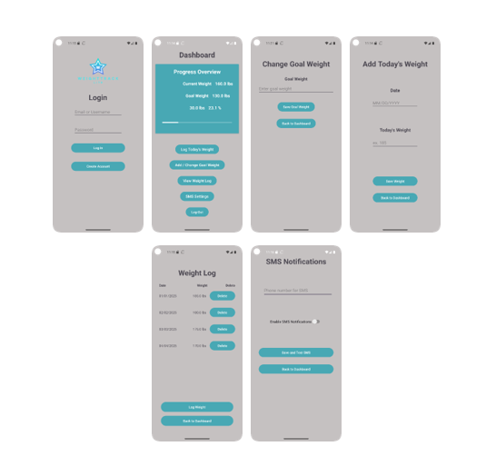

# WeightTrack Lite - Android Weight Tracking Application

Author: Jessica Johnson  
Language: Java / Android  
Platform: Android Studio  

---

## Overview

WeightTrack Lite is a mobile application designed to help users log, monitor, and manage their weight over time. The app focuses on simplicity and usability, allowing users to quickly record daily weight entries and track their progress toward personal health goals.

This project demonstrates core Android development concepts including activity navigation, SQLite data storage, user authentication interfaces, and mobile UI design.

The application was developed in Android Studio and highlights practical mobile development skills such as structured application architecture, persistent data storage, and user-centered interface design.

---

## Application Screenshots



## Key Features

• User login and account creation interface  
• Dashboard displaying current weight and progress  
• Daily weight logging functionality  
• Weight history tracking  
• Goal weight management  
• Optional SMS notification settings  
• User profile and account management

---

## Application Screens

### Login Screen
Allows returning users to securely access the application with a clean and simple interface.

### Registration Screen
Enables new users to create an account quickly with minimal required fields.

### Dashboard
Displays the user’s current weight, goal weight, and progress toward their goal.

### Log Weight Screen
Allows users to enter and store daily weight entries.

### Weight History
Displays previously recorded weight entries so users can track their progress over time.

### Goal Weight Screen
Users can set or update their target goal weight.

### Notification Settings
Allows users to enable or disable SMS notifications related to progress updates.

### User Profile
Provides access to account information and logout functionality.

---

## Technologies Used

Java  
Android Studio  
SQLite Database  
Android UI Components  
Activity Navigation  
Gradle Build System

---

## Project Structure
```
Android-Weight-Tracker-App
│
├── Weight_Track_Lite
│ ├── app/
│ │ ├── java/ # Application source code
│ │ ├── res/ # Layout files and UI resources
│ │ └── AndroidManifest.xml
│ │
│ ├── build.gradle
│ ├── settings.gradle
│ └── gradle/
│
└── README.md
``` 


The application follows a modular Android architecture separating UI components, logic, and data storage.

---

## Development Approach

Development followed an incremental approach where individual features were implemented and tested in stages using the Android emulator. This allowed functionality to be validated early and improved throughout development.

The project emphasizes clean navigation, simple user workflows, and responsible handling of user data and permissions.

---

## What I Learned

This project strengthened my understanding of:

• Android application architecture  
• Mobile UI/UX design principles  
• Data persistence using SQLite  
• Activity lifecycle and navigation  
• Incremental testing and debugging in Android Studio

It also helped connect UI design decisions with backend logic and data management within a mobile application.

---

## Future Improvements

• Data visualization charts for weight trends  
• Cloud synchronization  
• Enhanced progress analytics  
• Notifications and reminders for daily logging

---
